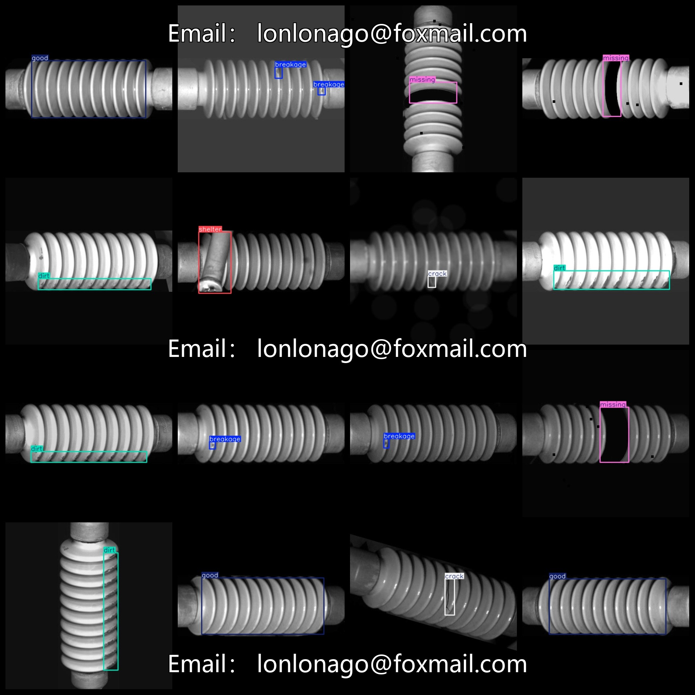
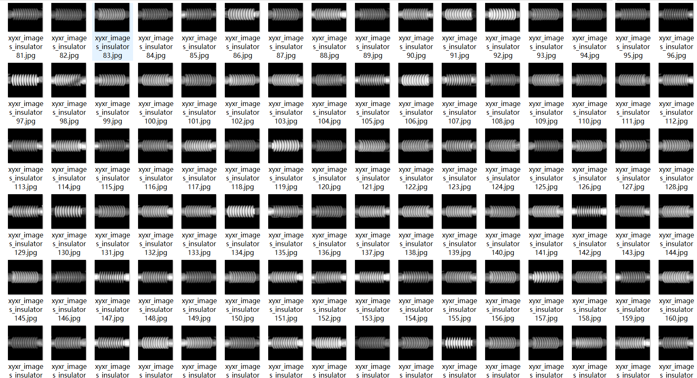

# Insulator Defect Data 7653 Images 7-class VOC+YOLO Format

Insulator Defect Data 7653 images in 7-class VOC+YOLO format.

Dataset format: VOC format + YOLO format.

The package contains three folders, each storing images, xml, and txt files.

In the JPEGImages folder, there are a total of 7653 JPG images.

In the Annotations folder, there are a total of 7653 xml files.

In the labels folder, there are a total of 7653 txt files.

There are 7 types of labels: ["breakage", "contamination", "crack", "dirt", "good", "missing", "shelter"].

The labels are as follows: [“Damaged”，“Contaminated”，“Cracked”，“Dirt”，“Good”，“Missing”，“Occluded”].

The number of boxes (note that the order of categories in the YOLO format does not correspond to this, but is based on the classes.txt in the labels folder):

breakage boxes = 952

contamination boxes = 555

crack boxes = 829

dirt boxes = 898

good boxes = 3741

missing boxes = 644

shelter boxes = 494

Total boxes: 8113

Image resolution (pixels): Clear

Image enhancement: Yes

Label shape: Rectangular box, used for object detection recognition

Important notes: No guarantees made about the accuracy or weights of trained models or data sets. The dataset provides accurate and reasonable annotations only.

Annotation and image details are as follows:
## Images

---

Here is a pay link on Stripe (https://buy.stripe.com/3cs8yP7sY87d0vu9AB). Please contact me lonlonago@foxmail.com after funding $89, and I will send you a complete data files, thank you!

